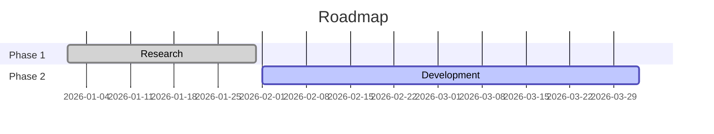

# StratMD v0.1 Specification

**Human-readable. AI-parseable. Git-native. Open. Portable.**

StratMD is a Markdown-native format for strategy documentation. It provides just enough structure to make strategy reliable for AI agents while remaining fully readable and editable by humans in any text editor.

## Introduction

Strategy documents often suffer from:
- Proprietary formats (lock-in)
- Unstructured text (drift, hard to query)
- Poor portability across tools
- Inefficiency for AI consumption

StratMD solves this by using plain Markdown with standardized YAML frontmatter, section headings, tables, and optional Mermaid diagrams. Files are portable, version-controlled via Git, and easy for agents to parse reliably.

## Document Types

StratMD supports five core document types with recommended naming conventions:

- **Foundation**: `foundation.strat.md` - Timeless elements (mission, values, beliefs, principles).
- **Strategy**: `[name].strategy.strat.md` - Major strategic thrusts (e.g., `viridis.strategy.strat.md`).
- **Initiative**: `[name].initiative.strat.md` - Projects or executions (e.g., `mvp.initiative.strat.md`).
- **Insight**: `YYYY-MM-DD-[title].insight.strat.md` - Key learnings or observations.
- **Metrics**: `[scope].metrics.strat.md` - KPI dashboards or tracking.

## File Structure

A valid StratMD file is plain Markdown with:

- Optional title H1
- Required YAML frontmatter (delimited by `---`)
- Standardized H2 sections
- Tables for structured data
- Optional Mermaid code blocks
- Wiki-style links for relationships (`[[filename#section]]`)

## Required Frontmatter

```yaml
type: foundation | strategy | initiative | insight | metrics
version: 0.1
schema: stratmd
status: draft | active | archived
owner: Name or Team
created: YYYY-MM-DD
last_updated: YYYY-MM-DD
```

Recommended additional fields:

```yaml
strategy_type: corporate | product | personal (for strategy type)
parent: filename.strat.md (for hierarchy)
time_horizon: short_term | medium_term | long_term
```

## Required Sections (Vary by Type)

### All Types
- **Changelog** (table at end)

### Foundation
- **Mission**
- **Vision**
- **Values** (list or table)
- **Beliefs** (table)
- **Principles** (table)

### Strategy / Initiative
- **Strategic Intent** - Core question answered + theme
- **Objective** - Clear, measurable outcome
- **Goals** (table)
- **Approach** - Narrative + phases + optional Mermaid
- **Risks** (table)
- **Actions** (table)

### Insight
- **Key Insight**
- **Evidence**
- **Implications**

### Metrics
- **Metrics Dashboard** (table)

## Recommended/Optional Sections

- **Context** - Background and trends
- **Key Assumptions** (table)
- **Strategic Constraints** - Non-goals, red lines (required for agent security)
- **Dependencies** (table)
- **Foundation Alignment** (table linking to values/beliefs)
- **Success Criteria** (checklist)
- **Relationships** (table: parent/child/related)
- **Decision Graveyard** (optional, for negative knowledge)

## Table Schemas

### Goals

| ID | Goal | Measure | Target | Deadline |
|----|------|---------|--------|----------|

### Risks

| ID | Risk | Likelihood | Impact | Mitigation | Owner |
|----|------|------------|--------|------------|-------|

### Actions

| ID | Action | Owner | Deadline | Status |
|----|--------|-------|----------|--------|

### Assumptions

| ID | Assumption | Confidence | Validation Method | Status |
|----|------------|------------|-------------------|--------|

### Decision Graveyard (v0.2 preview)

| ID | Rejected Option | Reason | Date | Impact |
|----|-----------------|--------|------|--------|

## Linking & Hierarchy

Use wiki-links: `[[parent.strat.md]]` or `[[parent.strat.md#Objective]]`

Agents can traverse for full context. Parent files enable inheritance (e.g., foundation alignment).

## Mermaid Support

Embed diagrams (e.g., roadmaps) with standard Mermaid blocks:



## Parsing Guidelines for Agents

- Load YAML frontmatter first as anchor
- Convert tables to arrays of objects
- Summarize narrative sections
- Check Constraints before any action
- Scan Graveyard to avoid repeats

## Examples

See the [Examples](/examples) section for complete documents:
- Foundation example with mission, values, and principles
- Strategy example with goals, risks, and approach
- Insight example with evidence and implications

## Changelog

| Date       | Change                  | Author         |
|------------|-------------------------|----------------|
| 2026-02-04 | Initial v0.1 release    | Leonard Cremer |

---

StratMD is open and evolvable. Contributions welcome at [github.com/Stratafy-ai/stratmd](https://github.com/Stratafy-ai/stratmd).

Enhanced collaboration and agent features available in [Stratafy](https://stratafy.ai).
