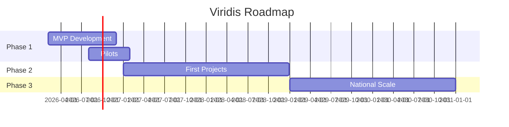

# Strategy: Viridis - Community Renewable Energy Platform

---
type: strategy
version: 0.1
schema: stratmd
strategy_type: corporate
parent: foundation.strat.md
status: active
time_horizon: medium_term
owner: Leonard Cremer
created: 2026-02-04
last_updated: 2026-02-04
---

## Strategic Intent

**Question Answered:** How can Viridis accelerate South Africa's just energy transition by enabling community-owned renewable energy projects at scale in coal-dependent regions like Mpumalanga?

**Theme:** Democratize renewable energy ownership through an AI-powered platform that connects communities, investors, and off-takers while handling planning, financing, and operations.

---

## Context

South Africa's energy crisis and coal dominance create urgent need and opportunity:
- Eskom load-shedding costs ~R300bn annually.
- Mpumalanga has excellent solar potential and degraded mining land.
- Community ownership in renewables remains <5%.
- Policy tailwinds: Just Energy Transition Partnership ($8.5bn), upcoming wheeling regulations.

Viridis fills the gap: turning communities into owners, not just beneficiaries.

---

## Objective

Facilitate 500 MW of community-owned renewable capacity by 2030, generating sustainable revenue for communities and attractive returns for investors.

---

## Goals

| ID | Goal                          | Measure                     | Current | Target   | Deadline   |
|----|-------------------------------|-----------------------------|---------|----------|------------|
| G1 | Platform live                 | MVP launched                | Concept | Live     | Q4 2026    |
| G2 | Pilot projects                | MW under management         | 0       | 10 MW    | Q2 2027    |
| G3 | Community revenue             | Annual distributions (ZAR)   | 0       | R50m     | 2030       |
| G4 | Investor capital              | Committed (USD)             | 0       | $200m    | 2028       |
| G5 | Platform revenue              | ARR (ZAR)                   | 0       | R100m    | 2030       |
| G6 | Carbon avoided                | Tons CO2e annually          | 0       | 800k     | 2030       |

---

## Approach

Phase 1 (2026): MVP with site assessment, financial modeling, community toolkit.
Phase 2 (2027-2028): First projects, operations stack, revenue sharing (40% community).
Phase 3 (2029+): National/SADC scale, add storage and new modules.

### What We're NOT Doing
- Utility-scale IPP competition
- Projects on high-value agricultural land
- Non-community ownership models

---

## Key Assumptions

| ID | Assumption                               | Confidence | Validation Method      | Status    |
|----|------------------------------------------|------------|------------------------|-----------|
| A1 | Wheeling regulations by 2027             | 70%        | NERSA monitoring       | Testing   |
| A2 | Solar+storage competitive vs Eskom       | 90%        | Market reports         | Validated |
| A3 | Communities allocate land for 25 years   | 75%        | Pilot engagements      | Testing   |

---

## Risks

| ID | Risk                          | Likelihood | Impact | Mitigation                       | Owner    |
|----|-------------------------------|------------|--------|----------------------------------|----------|
| R1 | Regulatory delays             | High       | High   | Early engagement, flexible models| Leonard  |
| R2 | Community trust disputes      | Medium     | High   | Local partnerships               | Community|
| R3 | Grid connection delays        | High       | High   | Municipal wheeling priority      | Ops      |

---

## Strategic Constraints

- Minimum 26% genuine community ownership (target 40%)
- Align with JET principles, no greenwashing
- Platform fees prioritize community benefit
- No high-agricultural-value land

---

## Actions

| ID | Action                               | Owner   | Deadline     | Status   |
|----|--------------------------------------|---------|--------------|----------|
| A1 | Build core platform modules          | CTO     | 2026-06-30   | Planned  |
| A2 | Secure 3 pilot MoUs                  | Leonard | 2026-08-31   | In Progress |
| A3 | Raise seed round                     | Leonard | 2026-09-30   | Planned  |

---

## Success Criteria

- [ ] MVP with pipeline by Q4 2026
- [ ] Revenue-generating projects by 2028
- [ ] Community satisfaction >80%
- [ ] 500 MW by 2030

---

## Relationships

| Relationship Type | Strategy/Initiative                  | Nature                  |
|-------------------|--------------------------------------|-------------------------|
| Parent            | foundation.strat.md                  | Core alignment          |
| Related           | jet-partnerships.strategy.strat.md   | Complementary           |

---

## Foundation Alignment

| Element Type | ID | Statement (summary)                  | Alignment |
|--------------|----|--------------------------------------|-----------|
| Value        | V2 | Create real-world impact             | Direct    |
| Belief       | B5 | Technology democratizes opportunity  | Core      |
| Principle    | P5 | Prioritize underserved regions       | Strong    |

---

## Decision Graveyard

| ID | Rejected Option               | Reason                          | Date       |
|----|-------------------------------|---------------------------------|------------|
| D1 | Focus on large IPPs           | Misaligned with community goal  | 2026-01-15 |

---

## Changelog

| Date       | Change                       | Author         |
|------------|------------------------------|----------------|
| 2026-02-04 | Initial draft                | Leonard Cremer |
