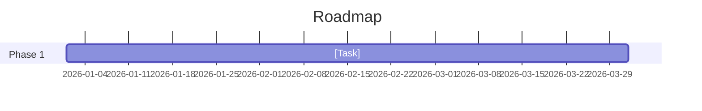

# Strategy: [Name]

---
type: strategy
version: 0.1
schema: stratmd
strategy_type: corporate | product | personal
parent: foundation.strat.md
status: draft
time_horizon: short_term | medium_term | long_term
owner: [Name or Team]
created: YYYY-MM-DD
last_updated: YYYY-MM-DD
---

## Strategic Intent

**Question Answered:** [Core question this strategy addresses]

**Theme:** [One-sentence theme or north star]

---

## Context

[Background, market trends, internal situation — why now?]

---

## Objective

[Clear, measurable primary outcome]

---

## Goals

| ID | Goal                  | Measure              | Current | Target | Deadline   |
|----|-----------------------|----------------------|---------|--------|------------|
| G1 |                       |                      |         |        |            |
| G2 |                       |                      |         |        |            |
| G3 |                       |                      |         |        |            |

---

## Approach

[High-level phases, key bets, or plays]

### What We're NOT Doing
-
-

---

## Key Assumptions

| ID | Assumption                          | Confidence | Validation Method | Status |
|----|-------------------------------------|------------|-------------------|--------|
| A1 |                                     |            |                   |        |

---

## Risks

| ID | Risk                                | Likelihood | Impact | Mitigation                  | Owner |
|----|-------------------------------------|------------|--------|-----------------------------|-------|
| R1 |                                     |            |        |                             |       |

---

## Strategic Constraints

-
-

---

## Actions

| ID | Action                              | Owner | Deadline   | Status |
|----|-------------------------------------|-------|------------|--------|
| A1 |                                     |       |            | Planned |

---

## Success Criteria

- [ ]
- [ ]

---

## Relationships

| Relationship Type | Strategy/Initiative          | Nature       |
|-------------------|------------------------------|--------------|
| Parent            | foundation.strat.md          | Core alignment |
| Child             | [child].initiative.strat.md  | Execution    |

---

## Foundation Alignment

| Element Type | ID | Statement (summary)         | Alignment  |
|--------------|----|-----------------------------|------------|
| Value        | V1 |                             |            |
| Belief       | B1 |                             |            |
| Principle    | P1 |                             |            |

---

## Decision Graveyard

| ID | Rejected Option                     | Reason                              | Date       |
|----|-------------------------------------|-------------------------------------|------------|
| D1 |                                     |                                     |            |

---

## Changelog

| Date       | Change                              | Author         |
|------------|-------------------------------------|----------------|
| YYYY-MM-DD | Initial draft created               | [Name]         |
